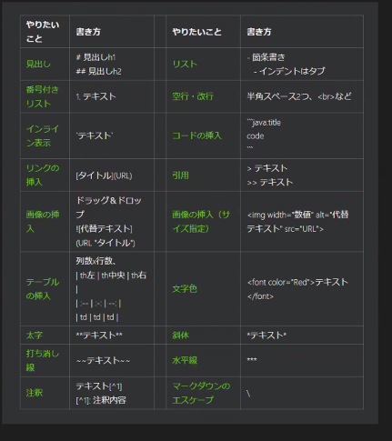

# 初めてのマークダウン

内容を書く

## 段落下げる 章

### さらに下げる　節

- 列挙

1. 1

win+shift+s 画像保存　クリップボードに保存

[VSCodeチートシート](https://qiita.com/kamorits/items/6f342da395ad57468ae3)

先頭に!で画像


[チートシート](https://qiita.com/kamorits/items/6f342da395ad57468ae3)

### 節2

```aaa```　プログラムコード

``` 
注目してほしい言葉
aaaa
bbbb
ccc
ccc
ccc
ccc
```

メモをそのままPDFにできる

Alt+ ↑↓　行を移動
Shift+Alt+↑↓　行をコピー
