# 5/14 PADでステップアップシートの自動入力

[](https://docs.google.com/forms/d/e/1FAIpQLScnx2nN4BqyWHHlRIoZYMNlFANU20JpPPQ3Mj21z5uA0CR59g/viewform?usp=pp_url&entry.857909715=%Now%&entry.141839259=%name%&entry.720459050=%toukou%&entry.1139565368=%CustomFormData['rikai']%&entry.1410752=%CustomFormData['speed']%&entry.1980341729=%CustomFormData['syokan']%&entry.1221145244=%CustomFormData['syukatu']%)

GoogleChrom、edgeでF12
入力値ID見れる
  
CRAD(クラッド)
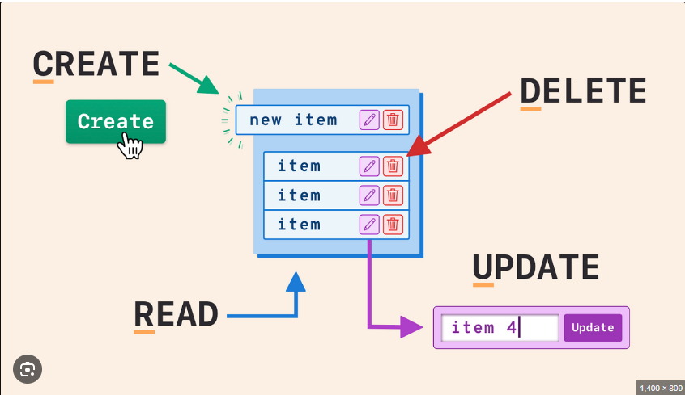

# 5/15

current＝現在の

astah* ソフトウェア開発支援ツール(有料)
UML 統一モデリング言語

## アルゴリズムとは

学問的
アルゴリズム（algorithm）とは、問題を解決したり目標を達成したりするための計算方法や処理方法を指す言葉です。手順に沿っていれば誰でも同じ答えが得られるもので、「算法」とも呼ばれます。
アルゴリズムを示した図をフローチャートと呼ぶ。
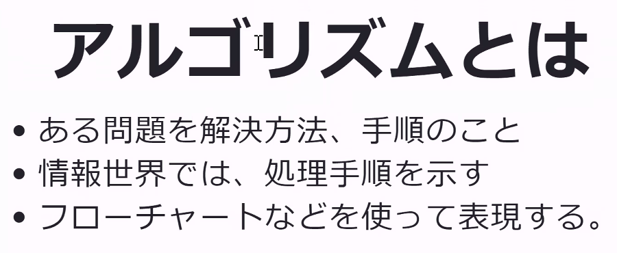

## ロジックとは

アルゴリズムは「問題を解くための手順」、ロジックは「思考の筋道」
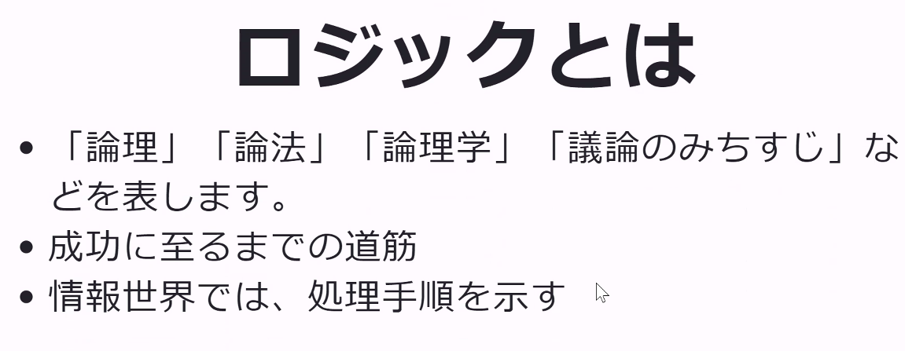

## ロジカルシンキング

- ＝論理思考
- 鍛えることができる
- [論理クイズ30選](https://gokkoland.com/articles/806)

## UMLとは

- Unified Modeling Languageの略
- 統一言語
- JIS 日本産業規格が存在す
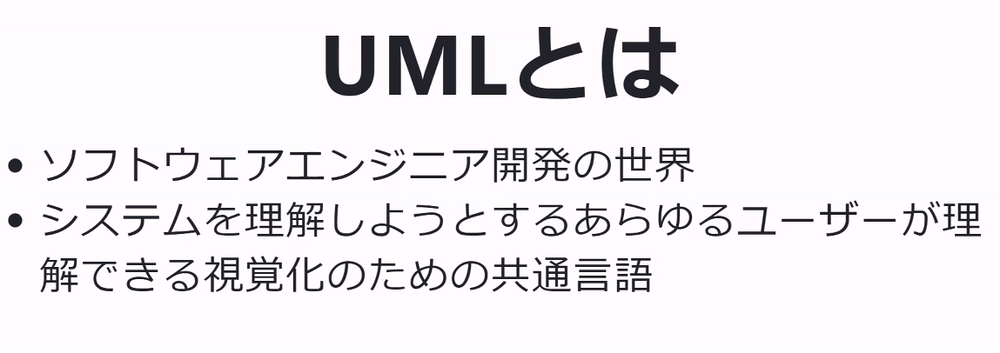

## フローチャートとは

Mendix

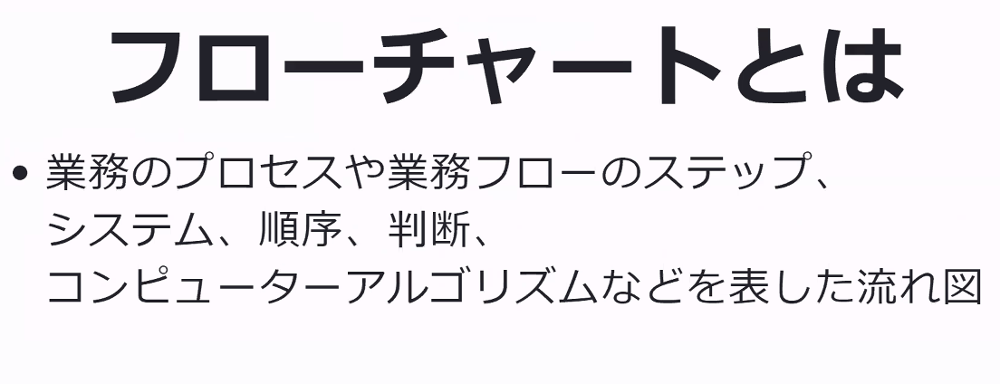

## プログラミングのポイント

- 同じことを書かない
- 戻らない
- プログラミングの3大制御構造
  
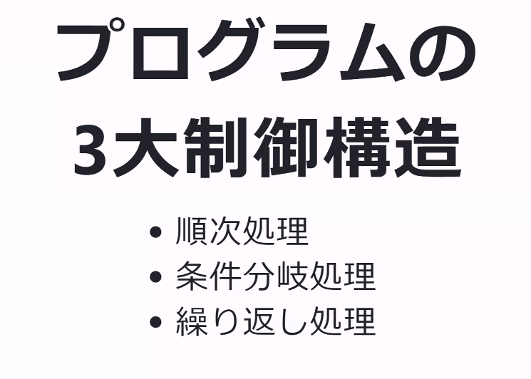

# 5/16 フローチャート,アルゴリズム

[配列の基礎](https://brain.cc.kogakuin.ac.jp/~kanamaru/lecture/prog1/06-01.html)

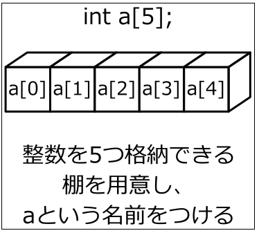

反復処理

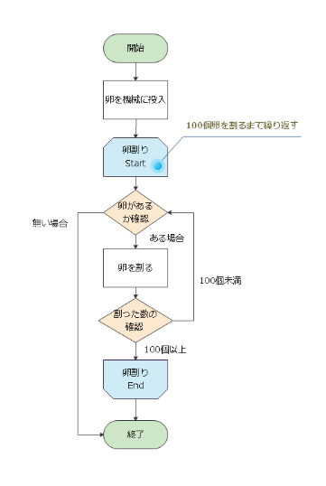

[フローチャート](https://open.shonan.bunkyo.ac.jp/~ohtan/jugyo/old/old2005aki/C-flowchart-2005.pdf)

[フローチャートとトレース](https://www.it.nias.ac.jp/hinata/2014zenki/files/subj14z/algo/0423ALGOL1A4ans.pdf)

[ざっくりわかる！プログラミングのためのフローチャートの書き方](https://eng-entrance.com/programming_flowchart)

## 順次処理とは

- 上から順番に処理を行う。

## 条件分岐処理

- 条件によって処理を分岐する。

## 繰り返し処理

- 条件によって処理を繰り返す。

## トレース

- プログラムの中の変数の値を可視化する

- 処理の流れを理解するときに使う

## 領域図

- プログラミングで言う変数のこと
- 値を保持するスペース

## 配列

- 複数の値をセットで保持するスペース
- 添字を使って値のやり取りを行う

# 5/17 GIT,バージョン管理システム

## GITとは

- チームで開発するためのツール
- バージョンを管理するためのシステムのこと
- リポジトリという倉庫にデータを入れる

## リポジトリとは

- データーの倉庫
- バージョンを管理
- 主に三種類ある

[GITとは](https://www.kagoya.jp/howto/it-glossary/develop/git/)

[GIT入門](https://backlog.com/ja/git-tutorial/)

[GIT用語解説](https://biz.hpg.co.jp/biz2020/column/1338/)

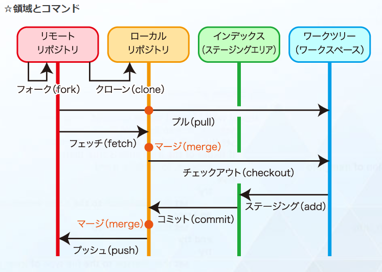

- ワークツリー　自分が作業する場所、仕事場
- ローカルリポジトリ　自分のPC、所属してるネットワーク。データを保管、バージョンを管理
- リモートリポジトリ　ネットワーク上のサーバーのようなもの
- インデックス　ワークツリーと同じ、変更した内容が記録されてる
- リポジトリ　貯蔵庫。データなどを保存しておく場所
- GIT　ソースコードや変更履歴を管理するために使われる、代表的な分散型バージョン管理システム

- ```★クローン　コマンド。オンライン上のものを自分のPCに複製```
- フォーク　リモートリポジトリからリモートリポジトリにコピー

- ``★プル　リモートからワークツリーにデータを持ってくる``
- フェッチ　データを確認するコマンド
- チェックアウト　ローカルからワークツリーにデータを持ってくる

- ``★コミット　追加・変更したファイルをGitに記録すること。バージョンを作ること``
- ``★プッシュ　作ったものみんなに共有``

- マージ　別の人が編集した内容を組み合わせる。リモート→ローカルその逆のときに必要
- コンフリクト　衝突。ブランチをマージする際に互いの変更点が重なってしまうことを指す

[Windows10でGitHubを始める～③GitHubでのメールアドレス設定とGitクライアントでのユーザ名・メールアドレス設定](https://qiita.com/emiki/items/4103150a5d7a7cfbff24)
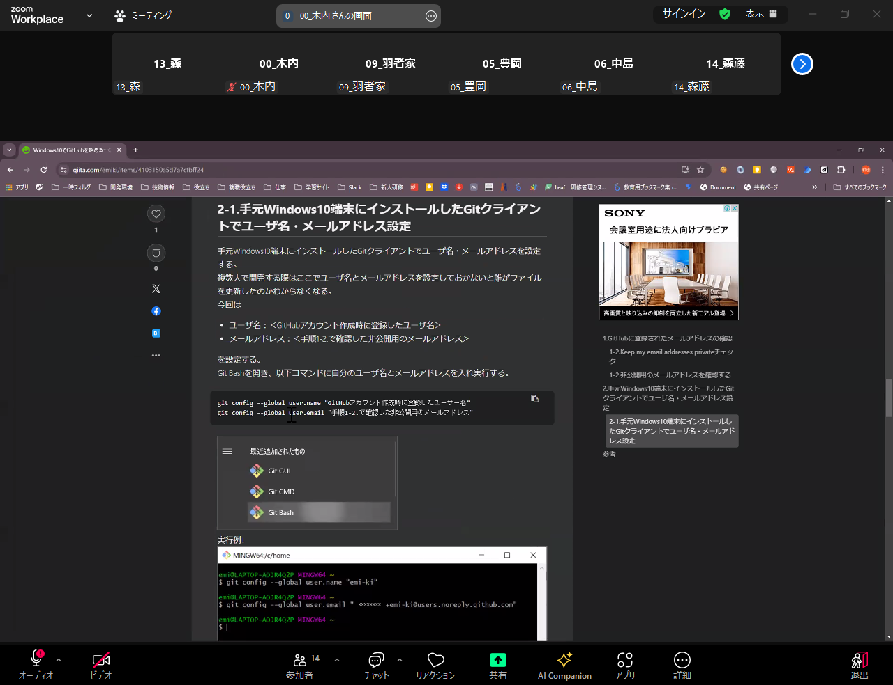

```ctrl+@ でターミナル出す```

[VSCodeとGitHubの連携手順](https://www.kagoya.jp/howto/rentalserver/webtrend/vscode/)

[新しいリポジトリの作成](https://docs.github.com/ja/repositories/creating-and-managing-repositories/creating-a-new-repository)

# 5/20 HTML

## HyperText Markup Languageの略で、マークアップ言語の1つ

- SEO　検索エンジンの最適化。検索時に上位に出るようにする。
- クローラー　検索エンジンがWebサイトの情報を収集するためにインターネット上を巡回させているロボットのこと。 英語で「這いまわる」という意味の「crawl」を語源としており、自動で動くプログラムであるため「ボット」、あるいはWeb（クモの巣）を巡回することから「スパイダー」とも呼ばれる。
- インデント　見やすくする。チームで開発するため可読性が重要。
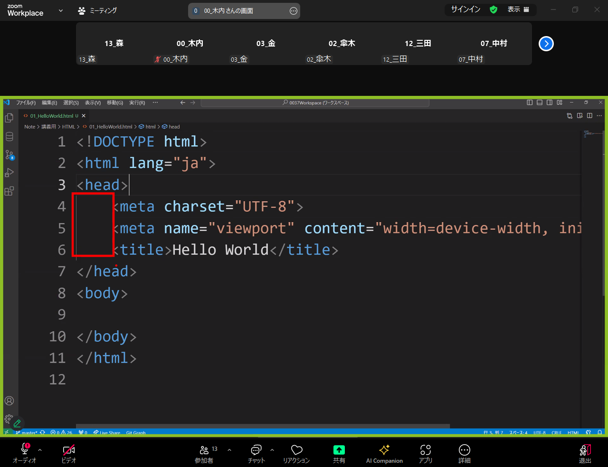

[HTML の基本 - ウェブ開発を学ぶ - MDN Web Docs](https://developer.mozilla.org/ja/docs/Learn)公式　範囲広くて分かりにくい？

[HTML5リファレンス（旧仕様）](https://www.htmq.com/html5/)

[HTML5 - とほほのWWW入門](https://www.tohoho-web.com/html/memo/html5.htm)

### ctrl+/ でコメント

- 影響を与えないコメント
- デメリット　データの送信量が増える
- いらない言葉を選択してctrl+/でコメントアウト

[WEBサイトのレイアウト構造について](https://rabbity-cms.com/blog/2019/02/21750/)
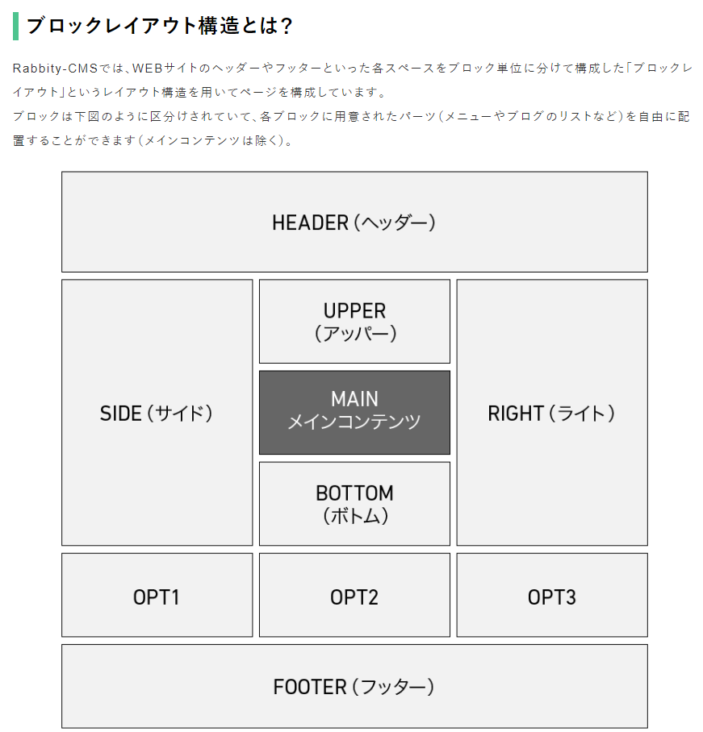


[UX改善の方法とは？現役UXデザイナーが改善のステップやポイントを解説！](https://blog.nijibox.jp/article/ux_improvement/)

[【知っておきたい】Webサイトの5つのレイアウト種類！メリットやおすすめサイトも解説](https://blog.nijibox.jp/article/website_layout/)
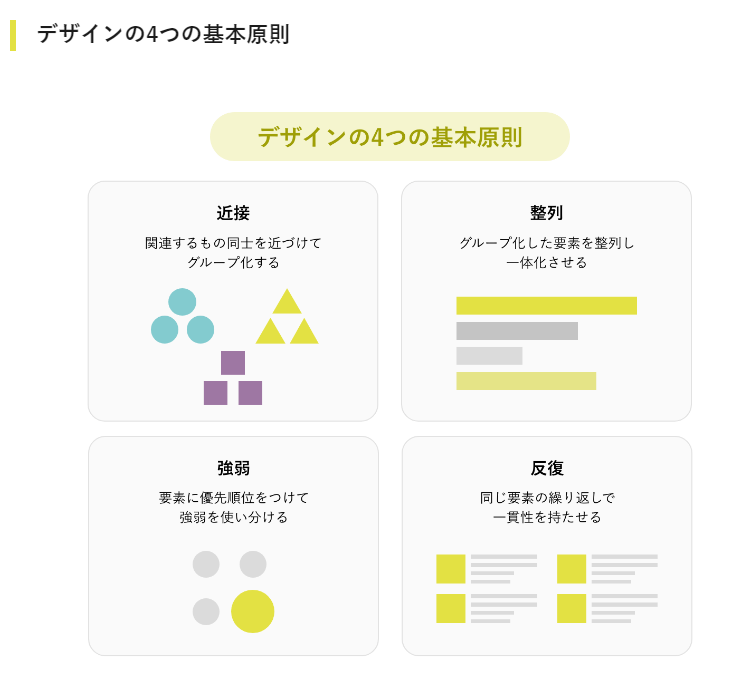

視線誘導の法則　日本人は基本右上から

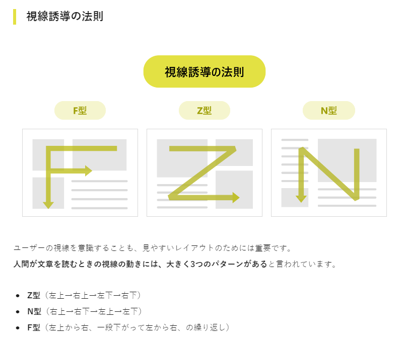

デザインはロジカルに考える

人間工学に基づいたデザイン(エルゴノミクスデザイン)も参考に

デザインは目的設定・計画策定・仕様表現からなる一連のプロセス

見た目時だけじゃない。設計。

[codepen](https://codepen.io/)ポートフォリオに使える。埋め込み

- **相対パス**
- **絶対パス**
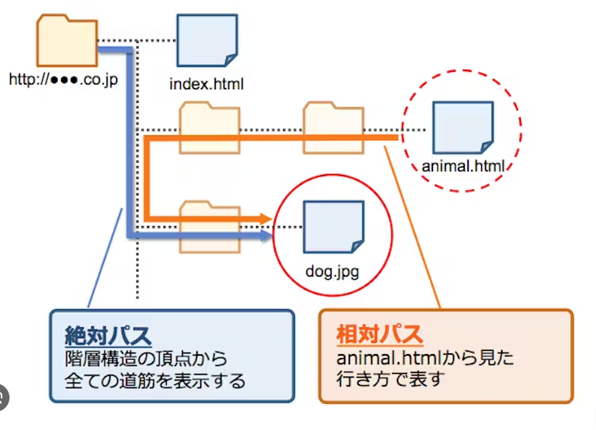

# 5/21 HTML

## HTML右クリック「ドキュメントのフォーマット」で整う

### ツリー構造

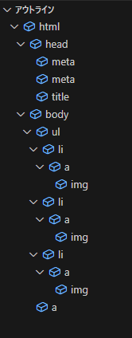

[絶対パスと相対パスとは？メリットや書き方・使い分け方を解説](https://verse-type.co.jp/column/hp_absolutepath-relativepath/)

- ./　今のフォルダ
- ../ は一つ前のフォルダ(階層)
- ../../　は2つ前のフォルダ(階層)
- 相対パスはサイト内リンク
- 絶対パスは外部リンク

### googlechrome　F12で開発者モード

[htmlのみで文字を装飾する方法（太字,下線,文字色,大きさ変更）](https://csshtml.work/html-word/)

- PWA（プログレッシブウェブアプリ）とは、Webサイトをアプリのように利用できるようにする技術。Webアプリがスマートフォン向けのアプリのような利便性を備えたフロントエンドの技術のこと

[px,pt,%,em 文字の大きさ 数値一覧表](https://www.nda.co.jp/memo/pxpt.html)

[CSS】em単位の特徴と使い方！rem・px・%との違いも解説](https://web-camp.io/magazine/archives/102270)

[【2023】おしゃれな配色パターンが見つかる！カラーパレット人気ツール28個まとめ](https://webdesign-trends.net/entry/15213)

[和色大辞典](https://www.colordic.org/w)

[大阪地下鉄8路線に込められた色の意味](http://osaka-subway.com/linecolor/)

- Emmet とは、HTML や CSS を省略記法で入力できるプラグイン

- [Emmetとは？これだけ知っておけばOK！](https://zenn.dev/miz_dev/articles/6cac5f2e32398d)

### ctrl+スペースで候補一覧

- **セレクター**
- ＃でID
- ．でClass

# 5/22

## shift+ctrl+lで同じ文字をまとめて選択

### shift+Alt+↑↓でコピー

[CSSのmarginとは？paddingとは？余白の指定方法まとめ](https://saruwakakun.com/html-css/basic/margin-padding)

- 四辺すべてに適用
margin: 1em;
margin: -3px;
- 上下 | 左右
margin: 5% auto;
- 上 | 左右 | 下
margin: 1em auto 2em;
- 上 | 右 | 下 | 左
margin: 2px 1em 0 auto;
- グローバル値
margin: inherit;
margin: initial;
margin: revert;
margin: revert-layer;
margin: unset;

### alt+↓↑で選択した行を移動

- 開発者モードで、要素の隣のボタンを押すと表示サイズチェックできる。
- スマホに対応できてるか等チェック
- 切り替わりをブレークポイントという


[レスポンシブとは？依頼者側も知っておくべきレスポンシブ対応の意味をわかりやすく解説
](https://roundsquare.design/blog/post_45/)

- header > a{}
- header a{}
- ヘッダーの中のa要素を指定
- ＞は直下。スペースは離れてても。

[【CSS】 子孫セレクタ、子セレクタ、隣接、複数など忘れがちなセレクタをまとめました＜前編＞](https://takayamato.com/selector-01/)

# 5/24 Googleスプレッドシート

[【Googleスプレッドシート】フィルタを自分だけに適用する個人フィルタの使い方](https://ponicom.net/spreadsheet-filter/#google_vignette)

[Googleスプレッドシート 完全攻略](https://technical.verybestcbp.com/category/spread/beginners/)

# 5/29 フォーム、ブートストラップ(フレームワーク)

## フォーム


- [HTTP リクエストメソッド](https://developer.mozilla.org/ja/docs/Web/HTTP/Methods)
- get　指定したリソースの表現をリクエスト。データの取り込みに限る。
- post　サーバー上の状態を変更
- 両方同時もできる
- required 論理属性。フォームが送信できるようにするためには値が必要
- disabled コントロールが無効であるかどうか
- name 入力欄コントロールの名前。名前/値の組の部分としてフォームと一緒に送信される
- placeholder フォームコントロールが空の時にフォームコントロール内に表示される内容
- checked コマンドやコントロールがチェックされているか
- URLの?以降get情報
- =右側　value　入力した数値
- =の左　変数、name
- [【3分で学習】今更聞けないGETとPOSTの違い](https://with.sunabaco.com/746)
- [Web制作者はダウンロードしておきたい！ CSS関連の最新版チートシートのまとめ](https://coliss.com/articles/build-websites/operation/css/css-cheatsheets-for-web-development.html)

## ブートストラップ(フレームワーク)

[Bootstrap](https://getbootstrap.jp/docs/5.3/getting-started/introduction/)

- BootstrapはウェブサイトやWebアプリケーションを作成するフロントエンドWebアプリケーションフレームワークのこと
- フレームワーク　プログラム開発に必要な機能をまとめた枠組みのこと
- [フレームワークとは？概要やプログラミング言語別の機能を分かりやすく解説](https://rookie.levtech.jp/guide/detail/147/)
- ライブラリは部品だけ
- フレームワークはセット(Bootstrap,Tailwind など)
- CDN　コンテンツ・デリバリー・ネットワーク
- ダウンロードせず使える
- [【入門】CDNとは？仕組みやメリットを図入りで分かりやすく](https://www.kagoya.jp/howto/it-glossary/web/cdn/)

# 5/30　ブートストラップ(フレームワーク)　続き、JavaScriptで何ができるか

## JavaScript

- [動くWebデザインアイディア帳](https://coco-factory.jp/ugokuweb/) 「動かしたいパーツ」ごとの逆引きリスト
- 無料公開2024年8月末まで
- 直リンクは相手のサーバーに不可がかかるのでしない
- [JavaScriptはプロトタイプベースのオブジェクト指向プログラミング言語ではない！？](https://jsstudy.hatenablog.com/entry/2017/03/29/181613)
- 

# 6/3

- イベントドリブン、イベント駆動型。イベントが発生したら動く
- [イベント・ドリブンとは](https://wa3.i-3-i.info/word13778.html)
- [先輩教えて！プログラミングのabc（第４回）---アプリケーションはどんな仕組みになっているの（中）](https://xtech.nikkei.com/it/members/NBY/techsquare/20030109/2/)
 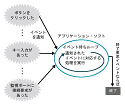
- データドリブン最近のはやり
- データが更新され、条件を満たしたら動く。
- リファレンス＝参照
- defined=定義された

## 命名規則

- **キャメルケース** ローワーキャメルケース。先頭の単語だけ小文字にしてあとの単語の先頭は大文字
- パスカルケース アッパーキャメルケース。すべての単語の先頭が大文字
- **スネークケース** アンダースコア（_）で各単語を区切っていく規則
- ケバブケース ハイフン（-）で各単語を区切っていく規則。ケバブの串のイメージ
- キャメル＝らくだのコブをイメージ。単語ごとに頭を上げてるか？ローワー下げる、小大。アッパー上げる、大大。
- [命名規則についてまとめてみた（キャメルケース，パスカルケース，スネークケース，ケバブケース）](https://qiita.com/shota0616/items/4ac7a8696b3f6ccbe2bc)
- [初心者プログラマーのための変数/関数/メソッドの英語命名規則](https://qiita.com/YutaManaka/items/62dda256bb7ba6c08399)

## 参照型

- [クラスの基本参照型について](https://kanda-it-school-kensyu.com/java-basic-contents/jb_ch02/jb_0204/)
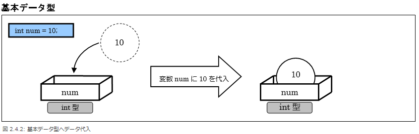
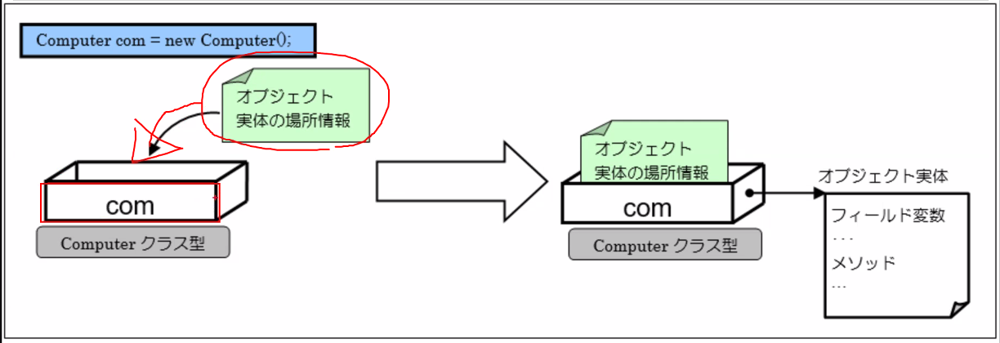

- [型システムwiki](https://ja.wikipedia.org/wiki/%E5%9E%8B%E3%82%B7%E3%82%B9%E3%83%86%E3%83%A0)
- JS　は動的型付けかつ、型推論型
- 動的型付けとは、変数や、サブルーチンの引数や返り値などの値について、その型を、コンパイル時など、そのプログラムの実行よりも前にあらかじめ決めるということをせず、実行時の実際の値による、という型システムの性質

## 演算子

- [【JavaScript】演算子一覧](https://qiita.com/white_tiger/items/bc3242dae2155f73ccbe)
- 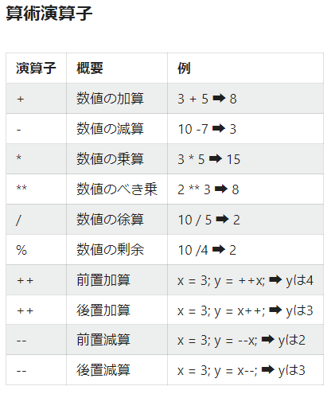

### 前置演算、後置演算

- [前置演算と後置演算の違いについて！変数へ代入した結果が異なる理由を徹底解説！](https://blog.proglus.jp/4069/)
- [【JavaScriptの基本】インクリメント演算子とデクリメント演算子における前置・後置の違い](https://tcd-theme.com/2022/01/javascript-increment-decrement.html)

### 演算子の優先順位

- [演算子の優先順位](https://developer.mozilla.org/ja/docs/Web/JavaScript/Reference/Operators/Operator_precedence)
- わからなくなったらコメントを書く。1行毎
- 昨日テキストp.70まで
- p.94～103

# 6/5　条件分岐 p.94~103

- IMEパッドで文字探す
- ない文字は使えない
- [【2024年版/初心者向け】HTMLのbuttonタグとは？onclick属性でリンクを付ける方法について初心者向けに解説！](https://mteam.jp/column/10169/#onclicknbsp)
- [初心者必見！JavaScriptのvalueを使いこなす7つの方法](https://jp-seemore.com/web/5481/)
- [【JavaScript】innerHTML/textContent/valueの違い](https://cod-aid.com/frontend/js_innerhtml-textcontent-value)
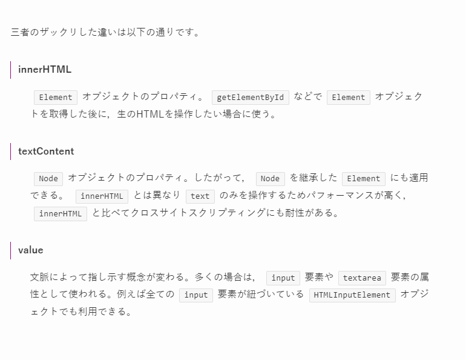

# 6/6　繰り返しP.104~118

// for文
// 初期化式：for文に初めて訪れた時実行される。
// 条件式：条件式の判定がtrueだったとき、ブロックが実行される
// 増分式：ブロック実行後に実行され、後に条件式で判定を行う。

- [JavaScriptを一から理解する: while / do...while](https://zenn.dev/doxper/articles/2108d0092f1921)
- [【授業メモ】JavaScript　for文の応用　多重ループ](https://shima0web.hatenablog.com/entry/2017/09/04/182358)

# 6/7 配列p.72~92,応用編p.114

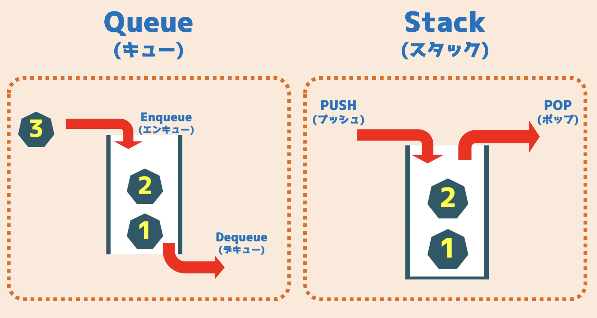

- 言語によって意味が違うので注意
- スタックは殆ど使わない
- キューは使う
- pushとpop覚える

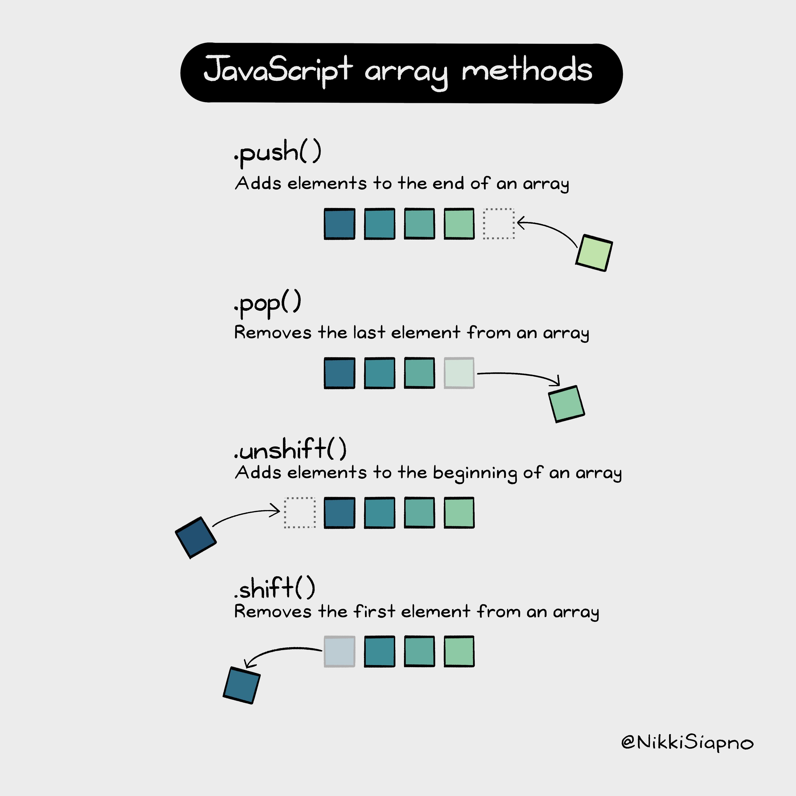
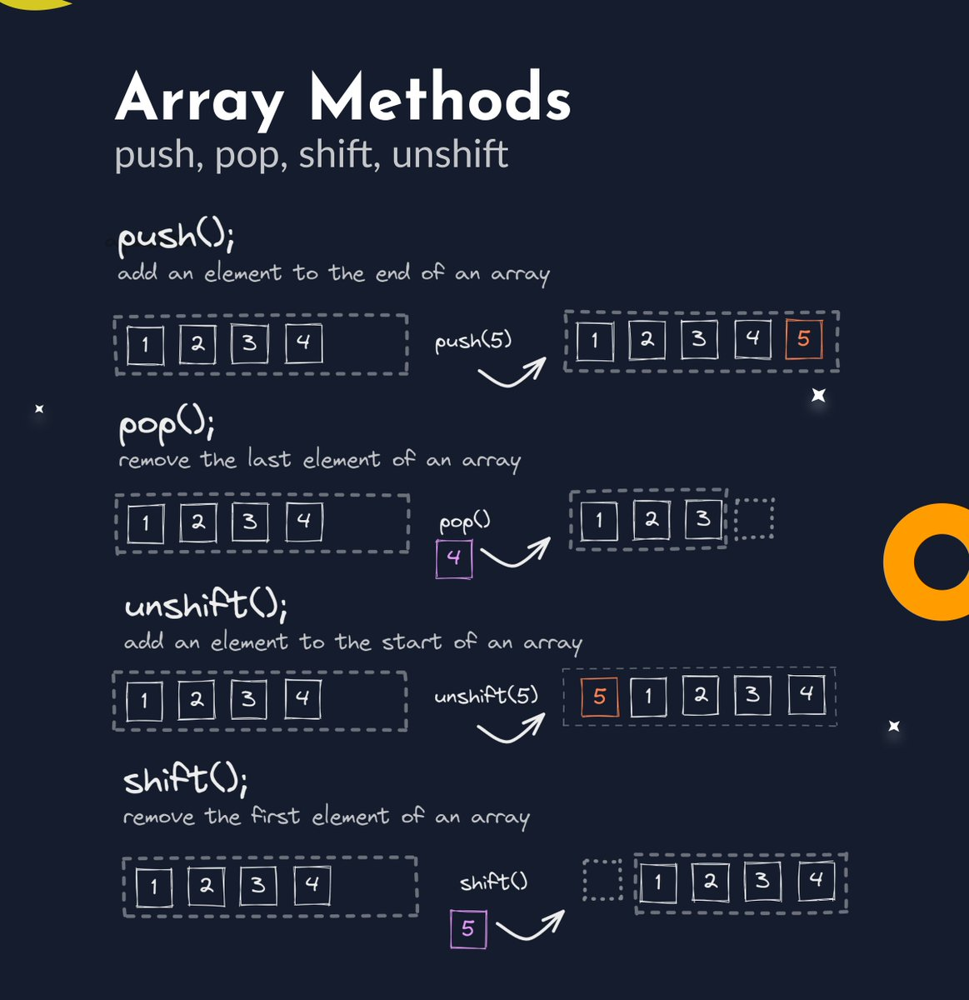

- [オブジェクトって何？](https://wa3.i-3-i.info/word1119.html)
- json JavaScript Object Notationの略
- JavaScriptのオブジェクト記法を用いたデータ交換フォーマットのこと
- [JSON入門](https://www.tohoho-web.com/ex/json.html)
- [JSONとは？データフォーマット（データ形式）について学ぼう！](https://products.sint.co.jp/topsic/blog/json)
- [天気予報API](https://weather.tsukumijima.net/)
- API Application Programming Interfaceの略
- ソフトウェアやプログラム、Webサービスをつなぐインターフェースのこと
- 配列きれいに書くコツ
- ｈｔｍｌを開く
- 仮にレイアウトを書く
- 切り取ってJSに貼り付ける
- 間違い探しをしない。ブラウザを開いて何のエラーが出てるか見る。
- 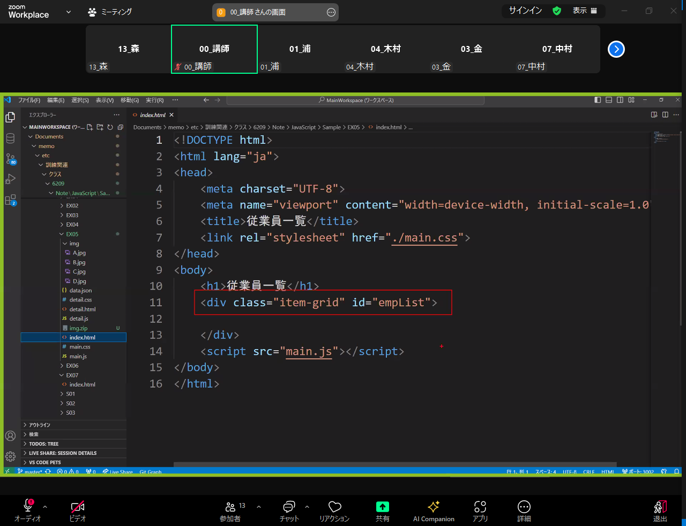

# 6/10

- HTTP リクエストメソッド
- [HTTP リクエストメソッド](https://developer.mozilla.org/ja/docs/Web/HTTP/Methods)
- よく出る2つ
- GET データベースの中身を取り込む　JSはこっちだけ
- POST　データベースの中身を書き換える

# 6/14 関数、オブジェクト

## 関数

- document.querySelector(selector)はdocument.getElementById('ID')みたいなもの
- プロパティはオブジェクトの変数
- メソッドは関数
- p197よく使う
- load(onload)
- submit
- click
- dblclick
- 198 (event,handler)handler関数実行しない。handler()にしない