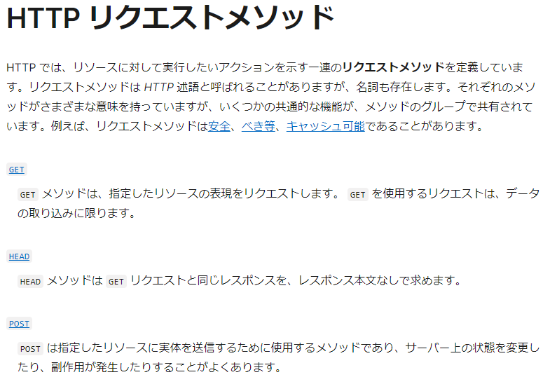
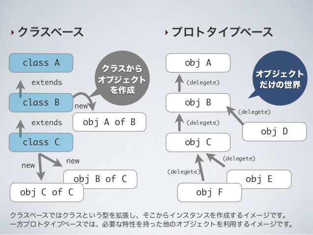

# 5/29 フォーム、ブートストラップ(フレームワーク)

## フォーム

- [HTTP リクエストメソッド](https://developer.mozilla.org/ja/docs/Web/HTTP/Methods)
- get　指定したリソースの表現をリクエスト。データの取り込みに限る。
- post　サーバー上の状態を変更
- 両方同時もできる
- required 論理属性。フォームが送信できるようにするためには値が必要
- disabled コントロールが無効であるかどうか
- name 入力欄コントロールの名前。名前/値の組の部分としてフォームと一緒に送信される
- placeholder フォームコントロールが空の時にフォームコントロール内に表示される内容
- checked コマンドやコントロールがチェックされているか
- URLの?以降get情報
- =右側　value　入力した数値
- =の左　変数、name
- [【3分で学習】今更聞けないGETとPOSTの違い](https://with.sunabaco.com/746)
- [Web制作者はダウンロードしておきたい！ CSS関連の最新版チートシートのまとめ](https://coliss.com/articles/build-websites/operation/css/css-cheatsheets-for-web-development.html)

## ブートストラップ(フレームワーク)

- [Bootstrap](https://getbootstrap.jp/docs/5.3/getting-started/introduction/)
- [Bootstrap使い方(公式)](https://getbootstrap.jp/docs/5.0/getting-started/introduction/)
- [Bootstrapの使い方をわかりやすく解説！導入から実装まで](https://zero-plus.io/media/bootstrap-how-to-use/)
- BootstrapはウェブサイトやWebアプリケーションを作成するフロントエンドWebアプリケーションフレームワークのこと
  
### フレームワーク

- [フレームワークとは？概要やプログラミング言語別の機能を分かりやすく解説](https://rookie.levtech.jp/guide/detail/147/)
- プログラム開発に必要な機能をまとめた枠組みのこと
- ライブラリは部品だけ
- フレームワークはセット(Bootstrap,Tailwind など)

### CDN

- [【入門】CDNとは？仕組みやメリットを図入りで分かりやすく](https://www.kagoya.jp/howto/it-glossary/web/cdn/)
- コンテンツ・デリバリー・ネットワークの略
- CDNでBootstrapをダウンロードせず使える(HTMLにリンクを埋め込むだけ)

# 5/30　JavaScriptで何ができるか

## JavaScript

- [動くWebデザインアイディア帳](https://coco-factory.jp/ugokuweb/) 「動かしたいパーツ」ごとの逆引きリスト
- 無料公開2024年8月末まで
- 直リンクは相手のサーバーに不可がかかるのでしない
- [JavaScriptはプロトタイプベースのオブジェクト指向プログラミング言語ではない！？](https://jsstudy.hatenablog.com/entry/2017/03/29/181613)
 
