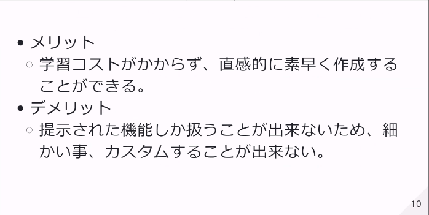
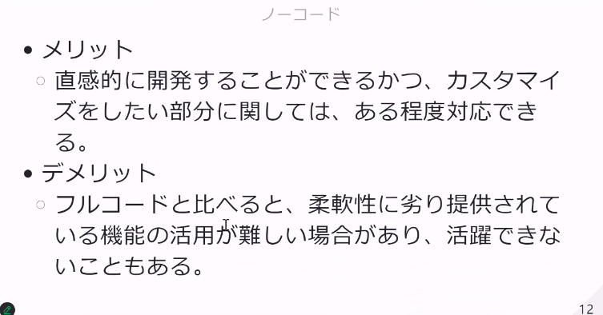

# サービス紹介

## ノーコード

### ホームページ開発

- [Wix](https://ja.wix.com/)　無料
- [Studio](https://studio.design/ja) 他のサービスと組み合わせる
- [ペライチ](https://peraichi.com/) ランディングページ。一枚の長い広告等
  
### アプリ開発

- [yappli](https://yapp.li/)
- [アプリワン](https://appli1.jp/) 有料でアプリ制作依頼
- [Click](https://click.dev/) 日本製 無料でも使える
- [Bubble](https://bubble.io/) 日本語対応なし

## ローコード

### システム開発

- [OutSystems](https://www.outsystems.com/ja-jp/) フロー図でシステム開発
- [ousystems活用例](https://www.dcs.co.jp/knowledge/column/outsystems/)
  
- [Mendix](https://www.mendix.com/ja/) 幅広く対応

### アプリ開発

- [AppSheet](https://cloud.google.com/appsheet?hl=ja) Google
- [PowerApps](https://www.microsoft.com/ja-jp/power-platform/products/power-apps) Microsoft 個人アカウント不可
- [FlutterFlow](https://flutterflow.io/) Google FLtterアプリ開発

### RPA

- [PowerAutmate](https://www.microsoft.com/ja-jp/power-platform/products/power-automate) Microsoft 業務の自動化
- [AsteriaWarp](https://www.asteria.com/jp/warp/) 各種クラウドサービスと連携

### その他

- [VVVV](https://visualprogramming.net/) 映像をプログラミングできる
- [UnrealEngine](https://www.unrealengine.com/ja) 3D
  
# まとめ

## ノーコードとは
一切プログラミング言語を使わずWebアプリやモバイルアプリを開発できる。

## ローコードとは

ビジュアルでプログラミングを行いアプリケーションの開発を行うことができる。

