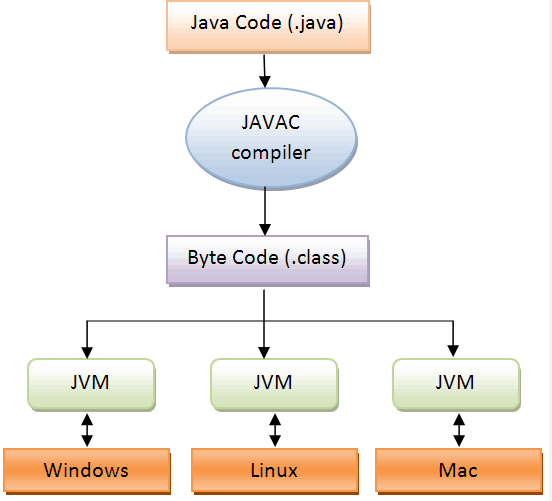
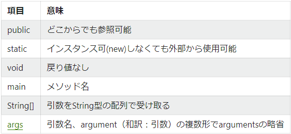

- JavaはC#に似てる
  - JSはスクリプト言語
  - スクリプト言語の別名　簡易プログラム言語
- Javaはコンパイル言語
  - 機会語に変換(コンパイル)して実行する必要がある
  - 処理速度が非常に早い
-  java 特徴
   -  コンパイル
   -  JVM(Javaの仮想マシン)

- マルチプラットフォームに対応
- JavaとJavascriptの違い
- Java
  - コンパイル言語
  - 静的型付け
  - 行末にセミコロン
- JavaScript
  - スクリプト言語
  - 動的型付け
- Java文法
  - 静的型付けについて
    - 変数を宣言するときに型を指定する必要がある
    - 整数型を宣言する場合
      - int number;
    - JavaScriptの場合
      - 宣言不必要 or let or ver
    - 変数には方が必要で、変化することがない
- if for while に関してはJSとほぼ同じ文法
- Javaの配列について
  - 基本が静的配列
    - 型が変化しない
    - 生成後要素数が変化しない
  - 宣言
    - int[] num;
  - 生成　要素数は5
    - num = new int[5];
- Javaの配列について2
  - 動的配列について
    - 一般的にArrayListを利用する
      - 形は変更できない
      - 要素数を変更することができる
      - 文字列方の動的配列
        - ArrayList<String> list = new ArrayList<>();
- 要素の追加
  - list.add("A");
- Javaはプログラム全体がClassで成り立ってる(例外は除く)
- Classについて
  - 基本はほぼ同じ
  - Javaでは、全てがClassで成り立ってる
    - プログラムのエントリーポイントはmainメソッド
    - public static void main(String args[]){}

- メソッドについて
- 引数、戻り値は型が指定されている
- 